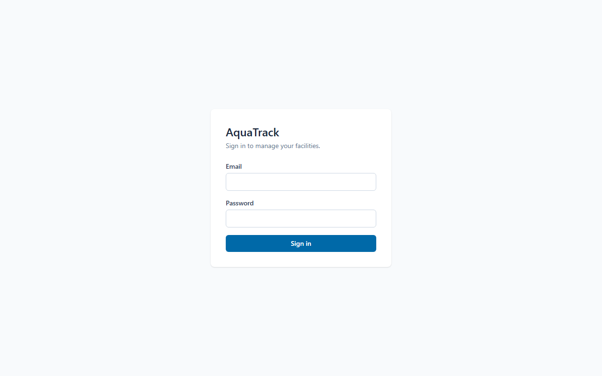
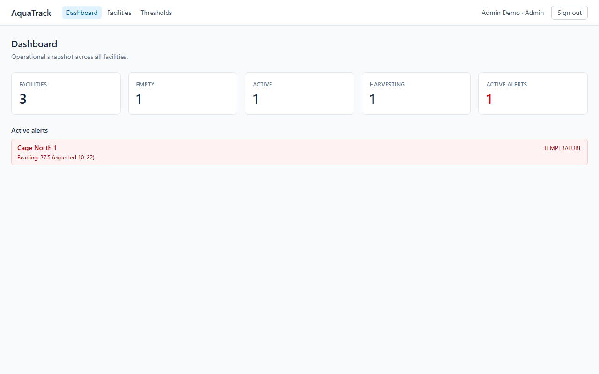
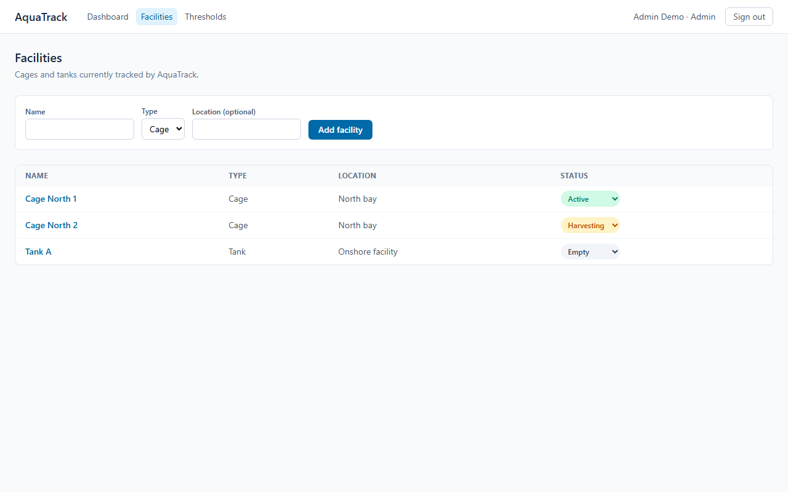
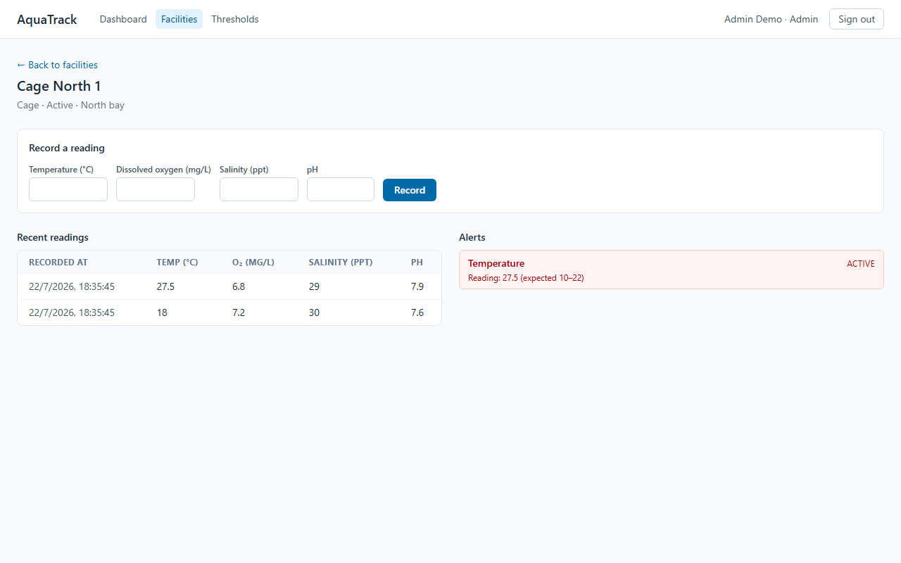
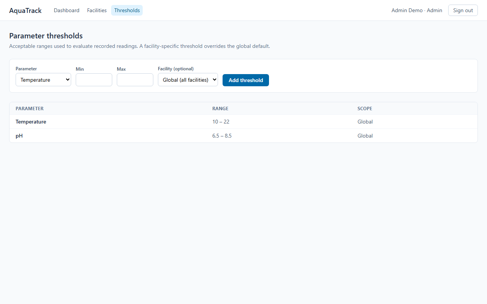
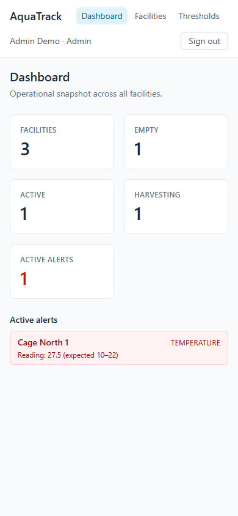
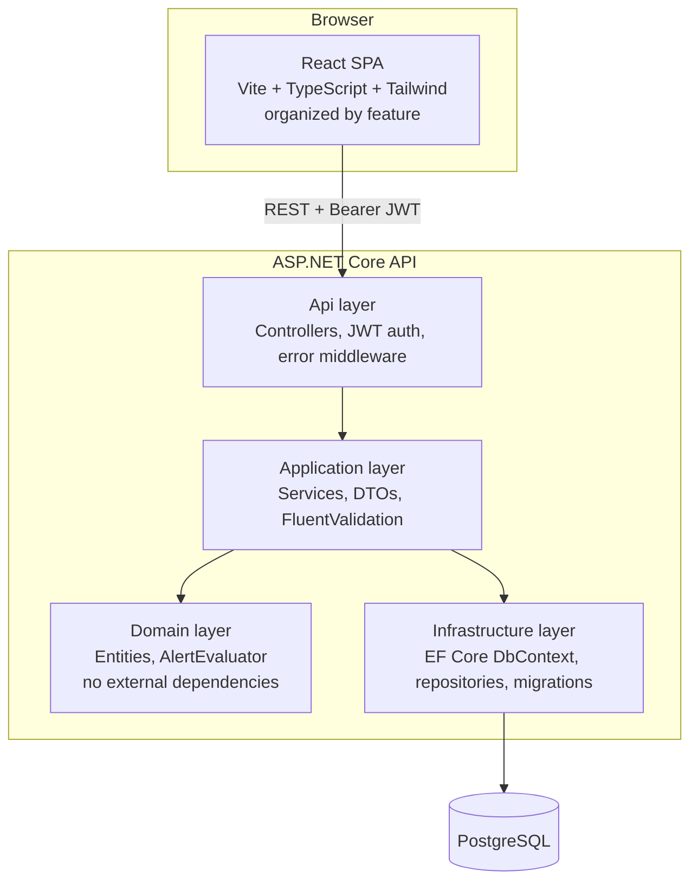

# AquaTrack

Operations management platform for aquaculture facilities — environmental monitoring, automatic
threshold alerts, and facility tracking, built around how a weekend shift lead actually needs to
check on a site.

A portfolio project, not a production app — but built and verified like one: real end-to-end tests
against a real Postgres instance, a real (headless) browser check before every merge, and every
design decision that mattered written down as it was made (see `CLAUDE.md`).

## Why this exists

Three years running weekend shifts and covering as deputy operations lead at an aquaculture site —
plus a stint as a co-founder at a microalgae startup — is where the domain shape comes from: what
actually gets checked on a round (temperature, dissolved oxygen, salinity, pH), what a threshold
breach needs to trigger, and who's allowed to change what. The implementation itself is written from
scratch for this project — no code, screens, table names, or business logic carried over from any
previous employer.

## Screenshots

| | |
|---|---|
| **Login** | **Dashboard** |
|  |  |
| **Facilities** | **Facility detail — readings & alerts** |
|  |  |
| **Parameter thresholds** | **Mobile (dashboard)** |
|  |  |

## Features

- **Auth** — JWT login, three roles (Admin / ShiftLead / Operator), no public registration (an
  internal operations tool, not a consumer product).
- **Facilities** — create and track cages/tanks, with status (Empty / Active / Harvesting).
- **Environmental readings** — record temperature, dissolved oxygen, salinity and pH per facility.
- **Automatic alerts** — every reading is evaluated against configurable thresholds the moment it's
  recorded; a breach surfaces immediately on the facility page and on the dashboard, not just on the
  next page load.
- **Parameter thresholds** — global defaults or facility-specific overrides.
- **Dashboard** — an operational snapshot: facility counts by status, every active alert across all
  facilities, one click from an alert to the facility it belongs to.

Role matrix: creating a facility or configuring thresholds is Admin-only; changing a facility's
status is Admin/ShiftLead; recording a reading is open to any authenticated role, because on an
actual site that's the operator's job.

## Tech stack

| Piece | Choice | Why |
|---|---|---|
| Frontend | React + TypeScript + Vite | Fast tooling, strong typing |
| Styling | Tailwind CSS | Fast iteration without hand-rolled CSS |
| Server state | TanStack Query | Cache, invalidation, and refetch without hand-rolled Redux |
| Backend | ASP.NET Core (C#) | Layered architecture, demonstrates .NET |
| ORM | Entity Framework Core | Migrations + LINQ, contrasts with the Dapper+SPs approach used in another portfolio project |
| Database | PostgreSQL | Diversifies from SQL Server elsewhere in the portfolio |
| Auth | JWT + roles | Stateless, standard, easy to reason about |
| Testing | xUnit + Moq (backend), Vitest + React Testing Library (frontend) | Standard per ecosystem |
| Infra | Docker + docker-compose, GitHub Actions CI | One command brings up the full stack locally |

## Architecture



Backend follows Clean Architecture (Domain → Application → Infrastructure → Api); nothing in
`Domain` references EF Core, ASP.NET Core, or any other external package. Frontend is organized by
feature (`src/features/<name>/`) rather than by technical type — each screen's API calls,
components, and tests live together.

## Running locally

```bash
cp .env.example .env
docker compose up -d
```

- Frontend: http://localhost:5173
- Backend / Swagger: http://localhost:5000/swagger
- Postgres: localhost:5433 (see `.env.example` for why it's not the default 5432)

Demo users (seeded automatically, one per role — see `backend/src/AquaTrack.Infrastructure/Persistence/DbInitializer.cs`):

| Role | Email | Password |
|---|---|---|
| Admin | `admin@aquatrack.dev` | `Admin123!` |
| ShiftLead | `shiftlead@aquatrack.dev` | `ShiftLead123!` |
| Operator | `operator@aquatrack.dev` | `Operator123!` |

For faster iteration than rebuilding the Docker image on every change, run Postgres in Docker and
the two apps natively:

```bash
docker compose up -d postgres
cd backend && dotnet run --project src/AquaTrack.Api
cd frontend && npm install && npm run dev
```

## Running tests

```bash
cd backend && dotnet test
cd frontend && npx vitest run
```

## Key technical decisions

The full log — every decision, with the reasoning and the date — lives in `CLAUDE.md` §7. Highlights:

- **Clean Architecture in the backend**, `Domain` free of any external dependency, to keep business
  rules (threshold breach → alert) testable in isolation from EF Core or ASP.NET Core.
- **JWT with no refresh tokens**, 8-hour expiry matching a shift length — a deliberate
  simplification for a portfolio-scale app, not an oversight.
- **Threshold resolution**: a facility-specific threshold overrides the global default for the same
  parameter, so one facility running warmer on purpose doesn't spam false alerts.
- **CORS is explicitly configured**, not left to a framework default — and finding out it was
  *missing* took an actual headless-browser check against the running app, not `curl` or the
  integration test suite (neither enforces a browser's same-origin policy, so both stayed green
  while every real login silently failed).
- **Frontend query-cache keys are namespaced by resource, not nested under the entity they happen to
  be filtered by** (`['readings', facilityId]`, not `['facilities', facilityId, 'readings']`) —
  TanStack Query invalidates by key prefix, so the wrong nesting meant creating a facility
  over-invalidated every other facility's readings and alerts.
- **Every slice was checked against a real backend, not just mocks** — `docker compose up` +
  `curl`/a headless browser before calling a feature done. This caught real bugs a type checker
  can't: a `PH` property serializing as `"ph"` (`System.Text.Json`'s camelCase policy collapsing a
  two-letter acronym), the missing CORS policy above, and a color-contrast/missing-landmark pass
  with `axe-core` that a code read alone wouldn't have surfaced.

## Roadmap

Fase 1 (MVP) is functionally complete, backend and frontend alike — see `PROGRESS.md` for the full
phase-by-phase checklist. What's next:

- **Fase 2**: shift/staff management, incident tracking, feeding logs, full batch traceability
  (seed → harvest).
- **Deployment**: backend → Railway/Render, frontend → Vercel, database → Neon/Supabase (not done
  yet — needs real cloud accounts this session didn't have access to).
- **Fase 3 (stretch)**: PDF report export, simulated real-time sensor data over WebSockets, email
  alerts on critical breaches, a public demo mode.
